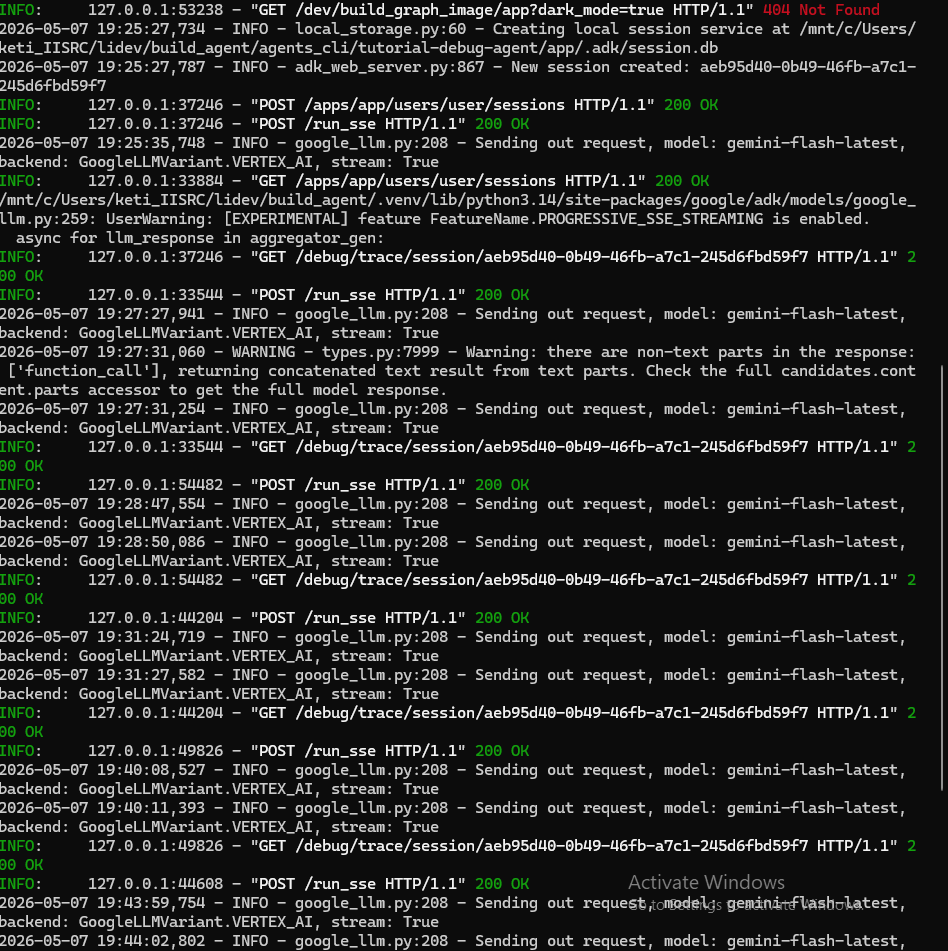
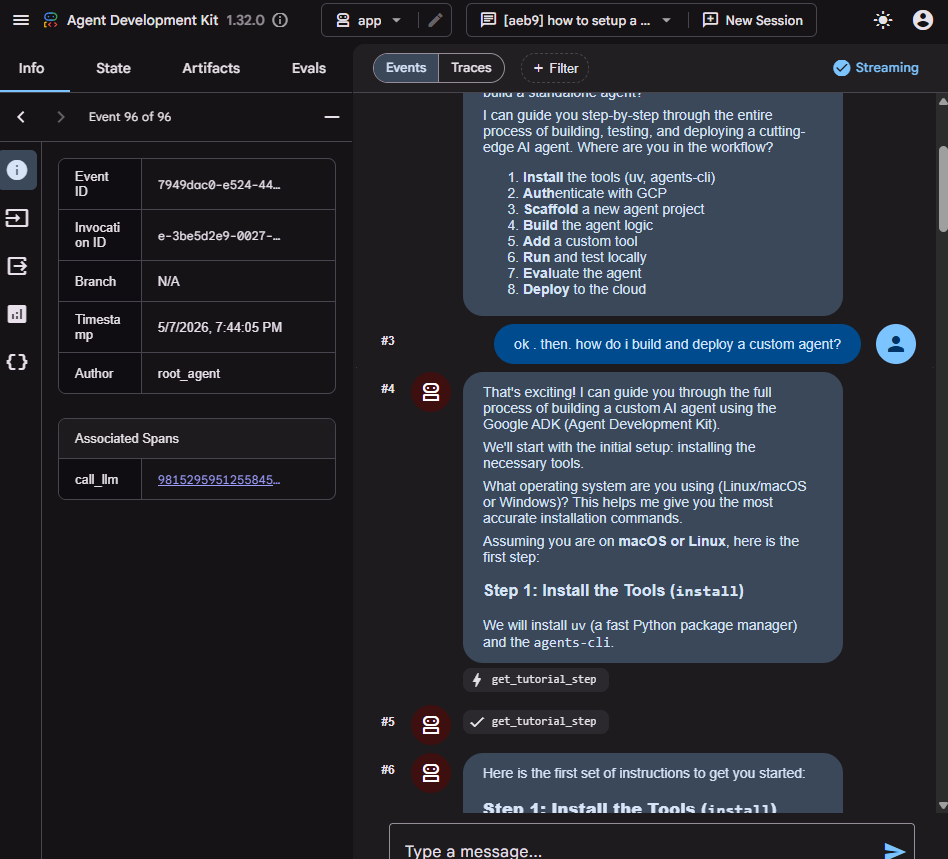
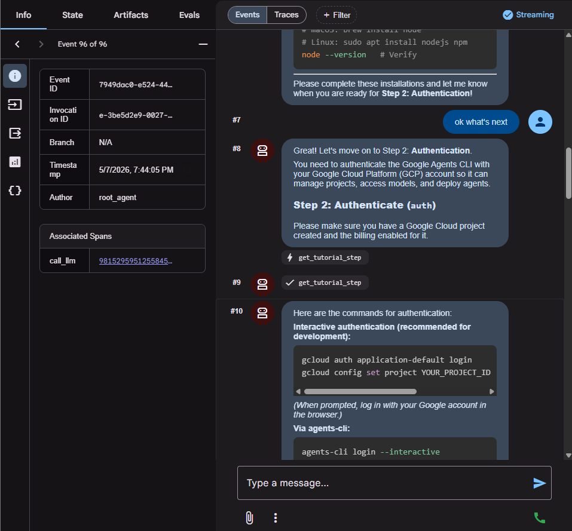

# Orchast Agent

A collection of AI agents built with [Google ADK](https://adk.dev/) (Agent Development Kit) and scaffolded using [Google Agents CLI](https://pypi.org/project/google-agents-cli/). Each agent in this repo demonstrates a focused use case — from text compression to interactive developer tooling.

## What is Google ADK?

[Google ADK](https://adk.dev/) is an open-source Python framework for building, evaluating, and deploying AI agents powered by Gemini models on Google Cloud. It provides:

- `Agent` — define behavior via instructions and tools
- `App` — the deployable unit wrapping your root agent
- Built-in evaluation, tracing, and Cloud deployment support

## What is Agents CLI?

[`google-agents-cli`](https://pypi.org/project/google-agents-cli/) is the companion command-line tool for ADK projects. It handles the full lifecycle:

| Command | Purpose |
|---|---|
| `agents-cli scaffold create` | Bootstrap a new ADK project |
| `agents-cli install` | Install project dependencies via `uv` |
| `agents-cli run "prompt"` | Run a single prompt against your agent |
| `agents-cli playground` | Launch interactive browser UI at `localhost:8000` |
| `agents-cli eval run` | Run LLM-as-judge evaluations |
| `agents-cli deploy` | Deploy to Agent Runtime, Cloud Run, or GKE |
| `agents-cli scaffold enhance` | Add CI/CD and Terraform infrastructure |

---

## Agents in this Repo

### 1. `caveman-compressor`

> Rewrites verbose text into terse, technical caveman-style grunts while preserving all technical meaning.

- **Model:** `gemini-flash-latest` via Vertex AI
- **Use case:** Compress meeting notes, specs, and long-form docs into compact bullets
- **Stack:** Google ADK · Agents CLI · Gemini · Vertex AI

[View agent →](./caveman-compressor/)

---

### 2. `tutorial-debug-agent`

> A hands-on guide and error debugger for developers building AI agents with Google ADK, Agents CLI, and Codex CLI.

- **Model:** `gemini-flash-latest` via Vertex AI
- **Use case:** Step-by-step ADK tutorials + paste-your-error terminal debugging
- **Tools:** `get_tutorial_step`, `analyze_terminal_error`
- **Stack:** Google ADK · Agents CLI · Gemini · Vertex AI

[View agent →](./tutorial-debug-agent/)

---

## Prerequisites

| Tool | Purpose | Install |
|---|---|---|
| [uv](https://docs.astral.sh/uv/) | Python package manager | `curl -LsSf https://astral.sh/uv/install.sh \| sh` |
| [google-agents-cli](https://pypi.org/project/google-agents-cli/) | ADK project CLI | `uv tool install google-agents-cli` |
| [Google Cloud SDK](https://cloud.google.com/sdk/docs/install) | GCP authentication & APIs | See link |

## Quick Start

### Option A — via Agents CLI

```bash
# 1. Authenticate with GCP
gcloud auth application-default login
gcloud config set project YOUR_PROJECT_ID

# 2. Pick an agent and install its dependencies
cd caveman-compressor   # or tutorial-debug-agent
agents-cli install

# 3. Run a prompt
agents-cli run "Your input here"

# 4. Or launch the interactive playground
agents-cli playground
```

### Option B — via ADK CLI (`adk web`)

The [ADK CLI](https://adk.dev/) ships its own web UI you can launch directly without Agents CLI.

```bash
# 1. Install ADK
pip install google-adk

# 2. Authenticate with GCP
gcloud auth application-default login
gcloud config set project YOUR_PROJECT_ID

# 3. Pick an agent folder
cd caveman-compressor   # or tutorial-debug-agent

# 4. Launch the ADK web UI
adk web
# Opens at http://localhost:8000
```

`adk web` streams agent responses in real time and shows tool call traces in the browser — useful for inspecting exactly what your agent is doing at each step.

## Screenshots

### Terminal — Agent server logs


### ADK Web UI — Tutorial mode


### ADK Web UI — Tool call traces


---

## References

- [Google ADK Documentation](https://adk.dev/)
- [google-agents-cli on PyPI](https://pypi.org/project/google-agents-cli/)
- [Google ADK GitHub](https://github.com/google/adk-python)
- [Vertex AI — Gemini Models](https://cloud.google.com/vertex-ai/generative-ai/docs/learn/models)
- [Codex CLI (OpenAI)](https://github.com/openai/codex)
